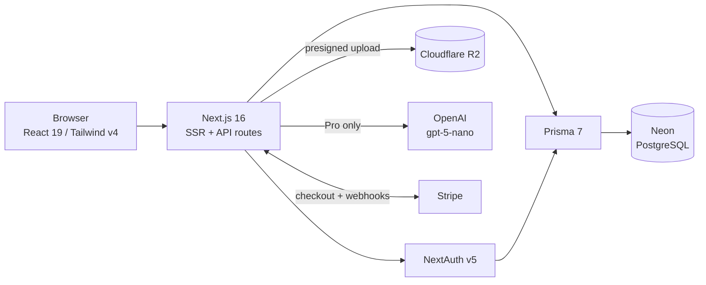
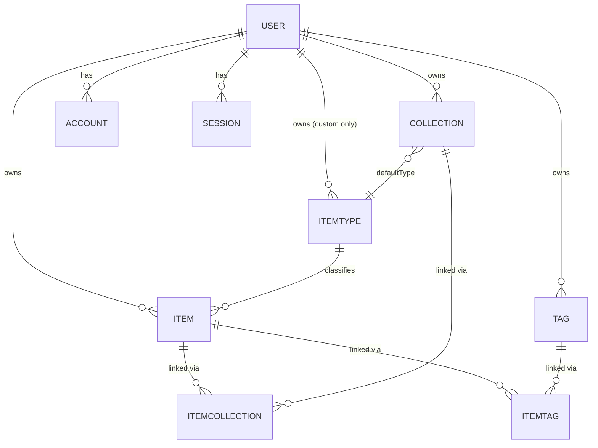

# DevStash — Project Overview

> **Status:** Planning / pre-build
> **One-liner:** One fast, searchable, AI-enhanced hub for everything a developer stashes — snippets, prompts, commands, links, notes, and files.

---

## 1. Problem

Developers scatter their essentials across too many tools:

| Asset | Usually lives in |
| --- | --- |
| Code snippets | VS Code, Notion |
| AI prompts | Chat histories |
| Context files | Buried in project folders |
| Useful links | Browser bookmarks |
| Docs | Random folders |
| Commands | `.txt` files, `~/.bash_history` |
| Project templates | GitHub Gists |

The result is constant context switching, lost knowledge, and inconsistent workflows. DevStash consolidates all of it into a single searchable store with AI on top.

---

## 2. Target Users

| Persona | Primary need |
| --- | --- |
| **Everyday developer** | Fast retrieval of snippets, prompts, commands, links |
| **AI-first developer** | Stores prompts, context files, system messages, workflows |
| **Content creator / educator** | Code blocks, explanations, course notes |
| **Full-stack builder** | Patterns, boilerplates, API examples |

---

## 3. Features

### A. Items & Item Types

Every stored object is an **Item**. Each Item has exactly one **ItemType**.

System types (immutable, seeded, `userId = null`):

| Type | Kind | Tier | Slug / Route |
| --- | --- | --- | --- |
| Snippet | text | Free | `/items/snippets` |
| Prompt | text | Free | `/items/prompts` |
| Note | text | Free | `/items/notes` |
| Command | text | Free | `/items/commands` |
| Link | url | Free | `/items/links` |
| File | file | Pro | `/items/files` |
| Image | file | Pro | `/items/images` |

- Users can create **custom types** later (Pro). System types cannot be edited or deleted.
- A type's `kind` (`TEXT` / `URL` / `FILE`) determines which fields the editor shows and which validation runs.
- Items are created and opened in a **drawer**, not a full page — speed is the core value prop.

### B. Collections

- A collection holds items of any type.
- An item can belong to **multiple** collections (e.g. a React snippet in both "React Patterns" and "Interview Prep") — handled via the `ItemCollection` join table.
- Examples: React Patterns, Context Files, Python Snippets.
- Users can add/remove items to/from collections and see which collections an item belongs to.

### C. Search

Single search bar across **content, title, tags, and type**. See §6 for implementation notes.

### D. Authentication

- Email + password (Credentials)
- GitHub OAuth
- NextAuth v5

### E. Supporting Features

- Favorite items and collections
- Pin items to top
- Recently used
- Import code from a file
- Markdown editor for text types (with syntax highlighting)
- File upload for `file` / `image` types
- Export data (JSON / ZIP)
- Dark mode by default, light mode optional
- Add/remove items to/from multiple collections

### F. AI Features (Pro)

- Auto-tag suggestions
- Summaries
- "Explain this code"
- Prompt optimizer

---

## 4. Tech Stack

| Layer | Choice | Notes |
| --- | --- | --- |
| Framework | Next.js 16 / React 19 | SSR pages with dynamic components |
| Language | TypeScript | Strict mode |
| Backend | Next.js API routes / server actions | Single repo, less overhead |
| Database | Neon (PostgreSQL) | Serverless Postgres |
| ORM | Prisma 7 | **Fetch latest docs — v7 changed the generator + client import path** |
| Cache | Redis | *Optional / defer to post-MVP* |
| File storage | Cloudflare R2 | S3-compatible SDK |
| Auth | NextAuth v5 | Credentials + GitHub |
| AI | OpenAI `gpt-5-nano` | Pro-gated, cost-capped |
| Styling | Tailwind CSS v4 + shadcn/ui | |
| Payments | Stripe | Subscriptions + webhooks |

### Migration Rule (non-negotiable)

> **NEVER** use `prisma db push` or modify the database structure by hand.
> All schema changes go through `prisma migrate dev` locally → committed → `prisma migrate deploy` in production.

### Reference Docs

| Tool | Link |
| --- | --- |
| Next.js | https://nextjs.org/docs |
| Prisma | https://www.prisma.io/docs |
| Neon | https://neon.com/docs |
| NextAuth (Auth.js) v5 | https://authjs.dev |
| Cloudflare R2 | https://developers.cloudflare.com/r2/ |
| Tailwind CSS v4 | https://tailwindcss.com/docs |
| shadcn/ui | https://ui.shadcn.com |
| Stripe Billing | https://docs.stripe.com/billing |
| OpenAI API | https://platform.openai.com/docs |

---

## 5. Architecture



---

## 6. Data Model

### Entity Relationships



### Prisma Schema (draft)

```prisma
generator client {
  provider = "prisma-client"
  output   = "../src/generated/prisma"
}

datasource db {
  provider = "postgresql"
  url      = env("DATABASE_URL")
}

// ---------- Enums ----------

/// Determines which fields an item of this type uses.
enum ItemKind {
  TEXT // snippet, prompt, note, command
  URL  // link
  FILE // file, image
}

// ---------- Auth (NextAuth v5) ----------

model User {
  id            String    @id @default(cuid())
  name          String?
  email         String    @unique
  emailVerified DateTime?
  image         String?
  passwordHash  String? // null for OAuth-only users

  // Billing
  isPro                  Boolean   @default(false)
  stripeCustomerId       String?   @unique
  stripeSubscriptionId   String?   @unique
  stripePriceId          String?
  stripeCurrentPeriodEnd DateTime?

  accounts    Account[]
  sessions    Session[]
  items       Item[]
  collections Collection[]
  itemTypes   ItemType[] // custom types only
  tags        Tag[]

  createdAt DateTime @default(now())
  updatedAt DateTime @updatedAt
}

model Account {
  id                String  @id @default(cuid())
  userId            String
  type              String
  provider          String
  providerAccountId String
  refresh_token     String?
  access_token      String?
  expires_at        Int?
  token_type        String?
  scope             String?
  id_token          String?
  session_state     String?

  user User @relation(fields: [userId], references: [id], onDelete: Cascade)

  @@unique([provider, providerAccountId])
  @@index([userId])
}

model Session {
  id           String   @id @default(cuid())
  sessionToken String   @unique
  userId       String
  expires      DateTime

  user User @relation(fields: [userId], references: [id], onDelete: Cascade)

  @@index([userId])
}

model VerificationToken {
  identifier String
  token      String   @unique
  expires    DateTime

  @@unique([identifier, token])
}

// ---------- Core ----------

model ItemType {
  id       String   @id @default(cuid())
  name     String // "Snippet"
  slug     String // "snippets" -> /items/snippets
  kind     ItemKind
  icon     String // lucide icon name, e.g. "Code"
  color    String // hex, e.g. "#3b82f6"
  isSystem Boolean  @default(false)
  isPro    Boolean  @default(false)

  userId String? // null for system types
  user   User?   @relation(fields: [userId], references: [id], onDelete: Cascade)

  items              Item[]
  defaultForCollections Collection[] @relation("CollectionDefaultType")

  createdAt DateTime @default(now())
  updatedAt DateTime @updatedAt

  @@unique([userId, slug])
  @@index([userId])
}

model Item {
  id          String  @id @default(cuid())
  title       String
  description String?

  // Content — exactly one branch populated, per ItemType.kind
  content  String? // TEXT
  url      String? // URL
  fileUrl  String? // FILE — R2 object URL
  fileKey  String? // FILE — R2 object key, needed for deletes
  fileName String?
  fileSize Int? // bytes
  mimeType String?

  language   String? // optional, for syntax highlighting
  isFavorite Boolean @default(false)
  isPinned   Boolean @default(false)
  lastUsedAt DateTime?

  userId     String
  user       User     @relation(fields: [userId], references: [id], onDelete: Cascade)
  itemTypeId String
  itemType   ItemType @relation(fields: [itemTypeId], references: [id])

  collections ItemCollection[]
  tags        ItemTag[]

  createdAt DateTime @default(now())
  updatedAt DateTime @updatedAt

  @@index([userId, createdAt])
  @@index([userId, itemTypeId])
  @@index([userId, isPinned])
  @@index([userId, lastUsedAt])
}

model Collection {
  id          String  @id @default(cuid())
  name        String
  description String?
  isFavorite  Boolean @default(false)

  /// Drives the card color before the collection has any items
  defaultTypeId String?
  defaultType   ItemType? @relation("CollectionDefaultType", fields: [defaultTypeId], references: [id])

  userId String
  user   User   @relation(fields: [userId], references: [id], onDelete: Cascade)

  items ItemCollection[]

  createdAt DateTime @default(now())
  updatedAt DateTime @updatedAt

  @@unique([userId, name])
  @@index([userId])
}

model ItemCollection {
  itemId       String
  collectionId String
  addedAt      DateTime @default(now())

  item       Item       @relation(fields: [itemId], references: [id], onDelete: Cascade)
  collection Collection @relation(fields: [collectionId], references: [id], onDelete: Cascade)

  @@id([itemId, collectionId])
  @@index([collectionId])
}

model Tag {
  id   String @id @default(cuid())
  name String

  userId String
  user   User   @relation(fields: [userId], references: [id], onDelete: Cascade)

  items ItemTag[]

  createdAt DateTime @default(now())

  @@unique([userId, name])
  @@index([userId])
}

model ItemTag {
  itemId String
  tagId  String

  item Item @relation(fields: [itemId], references: [id], onDelete: Cascade)
  tag  Tag  @relation(fields: [tagId], references: [id], onDelete: Cascade)

  @@id([itemId, tagId])
  @@index([tagId])
}
```

### Changes from the original notes

These are deliberate deviations — flagged so they can be accepted or rejected:

1. **Dropped `Item.contentType`.** The original had both `contentType` on the item *and* a text/url/file distinction on the type. That's two sources of truth. Content shape now derives from `ItemType.kind`.
2. **Added `ItemType.slug`** — required for `/items/snippets` style routes without slugifying display names at request time.
3. **Added `ItemTag` join table.** The notes list `Tag` with no relation; many-to-many needs an explicit (or implicit) join.
4. **Scoped `Tag` to a user** with `@@unique([userId, name])`. Global tags would leak one user's vocabulary into another's autocomplete.
5. **Added `fileKey` and `mimeType`** — you cannot delete an R2 object from a public URL alone, and mime type is needed for image previews and upload validation.
6. **Added `lastUsedAt`** — "Recently used" needs a real column, not `updatedAt` (which changes on every edit).
7. **Added Stripe `stripePriceId` / `stripeCurrentPeriodEnd`** — needed to distinguish monthly vs. annual and to grant access through the end of a cancelled period.
8. **Added `ItemType.isPro`** so file/image gating is data-driven rather than hardcoded.

### Search Implementation

Start simple, upgrade if it becomes a bottleneck:

- **Phase 1:** Postgres `ILIKE` across title/content/description + tag name join. Fine to a few thousand rows per user.
- **Phase 2:** `tsvector` generated column with a GIN index, plus `pg_trgm` for fuzzy title matching. Both are supported on Neon.
- Filters (type, collection, favorites) applied as SQL predicates alongside the text match, not client-side.

---

## 7. Monetization

Freemium. **Build the Pro plumbing from day one, but leave all features unlocked during development** behind a single feature flag.

| | Free | Pro — $8/mo or $72/yr |
| --- | --- | --- |
| Items | 50 total | Unlimited |
| Collections | 3 | Unlimited |
| System types | All except File/Image | All |
| File & image uploads | ✗ | ✓ |
| Custom types | ✗ | ✓ *(later)* |
| Search | Basic | Full |
| AI auto-tagging | ✗ | ✓ |
| AI summaries / explain code | ✗ | ✓ |
| AI prompt optimizer | ✗ | ✓ |
| Export (JSON / ZIP) | ✗ | ✓ |
| Support | Standard | Priority |

**Enforcement notes**
- Limits checked **server-side** on create, never only in the UI.
- Decide downgrade behavior: over-limit items should most likely become read-only rather than being deleted.
- Stripe webhooks (`checkout.session.completed`, `customer.subscription.updated`, `customer.subscription.deleted`) are the only writer of `isPro`.
- AI calls need a per-user rate limit and a monthly token cap, even on Pro.

---

## 8. UI / UX

### Principles

- Modern, minimal, developer-focused
- Dark mode default, light mode optional
- Clean typography, generous whitespace, subtle borders and shadows
- References: **Notion, Linear, Raycast**
- Syntax highlighting on all code blocks

### Layout

```
┌────────────┬──────────────────────────────────────┐
│  SIDEBAR   │  MAIN                                │
│            │                                      │
│  Search    │  ┌────────┐ ┌────────┐ ┌────────┐    │
│            │  │Collect.│ │Collect.│ │Collect.│    │  ← background color =
│  TYPES     │  │  card  │ │  card  │ │  card  │    │    dominant item type
│  Snippets  │  └────────┘ └────────┘ └────────┘    │
│  Prompts   │                                      │
│  Commands  │  ┌──────────────────────────────┐    │
│  Notes     │  │ Item card                    │    │  ← border color = item type
│  Links     │  ├──────────────────────────────┤    │
│  Files     │  │ Item card                    │    │
│  Images    │  └──────────────────────────────┘    │
│            │                                      │
│  RECENT    │            ┌─────────────────────────┤
│  COLLECT.  │            │  ITEM DRAWER            │
│            │            │  (opens over main)      │
└────────────┴────────────┴─────────────────────────┘
```

- **Sidebar:** collapsible. Item types linking to `/items/[slug]`, plus latest collections.
- **Main:** grid of collection cards, background color derived from the type most represented in that collection (falls back to `defaultType`). Items render beneath as cards with a type-colored **border**.
- **Drawer:** individual items open in a quick-access drawer for both view and create.
- **Mobile:** desktop-first, but sidebar collapses to a drawer and the grid goes single-column.

### Type Colors & Icons

Icons are [lucide-react](https://lucide.dev/icons/) names.

| Type | Icon | Hex | Swatch |
| --- | --- | --- | --- |
| Snippet | `Code` | `#3b82f6` | 🟦 blue |
| Prompt | `Sparkles` | `#8b5cf6` | 🟪 purple |
| Command | `Terminal` | `#f97316` | 🟧 orange |
| Note | `StickyNote` | `#fde047` | 🟨 yellow |
| File | `File` | `#6b7280` | ⬜ gray |
| Image | `Image` | `#ec4899` | 🩷 pink |
| Link | `Link` | `#10b981` | 🟩 emerald |

> ⚠️ `#fde047` (Note) fails contrast against a light background and will wash out as a border color in light mode. Consider a darker variant (e.g. `#eab308`) for light theme, or reserve the light yellow for dark mode only. Define each color as a CSS variable with a light/dark pair.

### Micro-interactions

- Smooth transitions between states
- Hover states on all cards
- Toast notifications for create / update / delete / copy
- Loading skeletons, not spinners

---

## 9. Routes

| Route | Purpose |
| --- | --- |
| `/` | Dashboard — pinned, recent, favorite collections |
| `/items` | All items |
| `/items/[typeSlug]` | Items filtered by type (`/items/snippets`) |
| `/collections` | All collections |
| `/collections/[id]` | Single collection |
| `/search` | Full search results |
| `/settings` | Profile, theme, export, billing |
| `/pricing` | Plan comparison + Stripe checkout |
| `/login`, `/register` | Auth |

| API | Purpose |
| --- | --- |
| `/api/auth/[...nextauth]` | NextAuth handler |
| `/api/items` · `/api/items/[id]` | Item CRUD |
| `/api/collections` · `/api/collections/[id]` | Collection CRUD |
| `/api/collections/[id]/items` | Add/remove items to a collection |
| `/api/upload` | R2 presigned URL |
| `/api/ai/[action]` | tag / summarize / explain / optimize |
| `/api/export` | JSON / ZIP export |
| `/api/stripe/checkout` · `/api/stripe/webhook` | Billing |
